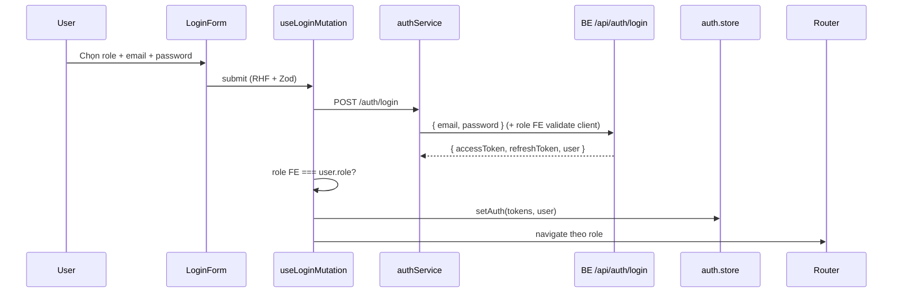
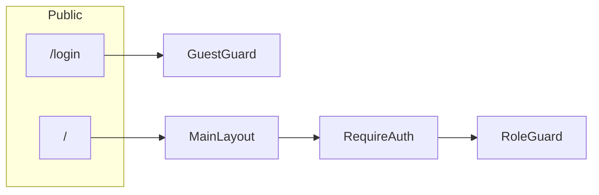

# OJT KNS SU26 — Frontend

Hệ thống hỗ trợ học tập AI cho Aviation Academy.

| | |
|---|---|
| **Nhánh làm việc** | `dev` (auth đã merge; có thể tách `feature/duy-quang` khi cần) |
| **Requirement** | SE-F1 — Authentication & Authorization |
| **Owner** | **Quang** — login, session, guards, layout, API client |
| **PR target** | `dev` (không merge thẳng `main`) |
| **Liên hệ BE** | **Chinh** — Auth API |

> Đọc file này để chạy FE, hiểu auth flow và tiếp tục code trên `dev`.

---

## Mục tiêu nhánh này

Nền tảng Frontend cho đăng nhập và phân quyền. Các AE tiếp tục build feature trên scaffold này:

| AE | Role | Route sau login | Folder làm việc |
|----|------|-----------------|-----------------|
| **Vũ** | Student | `/student` (+ sub-pages) | `src/features/student/` |
| **Long** | Teacher | `/teacher/dashboard` | `src/features/dashboard/` |
| **Quốc Anh** | Admin | `/admin/dashboard` | `src/features/dashboard/` |

**Quy tắc sản phẩm:**

- Không có **Register** public — tài khoản do Admin cấp
- Login full-page tại `/login` (tách khỏi `MainLayout`)
- Login: chọn role (Student / Teacher / Admin) + email + password
- Logo máy bay trên login → click về Home (`/`)
- UI: shadcn/ui + theme aviation

---

## Quick start

```bash
git fetch origin
git checkout dev
git pull origin dev

cd FE
cp .env.example .env   # VITE_API_URL=/api
npm install
npm run dev
```

**BE (Chinh)** — chạy song song port 3000, cần MongoDB (hỏi team file `env` / Atlas):

```bash
cd BE
cp .env.example .env   # thêm MONGODB_URI hoặc DB_USERNAME/DB_PASSWORD
npm install
npm run dev
```

| | URL |
|---|---|
| FE | http://localhost:5173 |
| BE (proxy dev) | `/api` → `http://localhost:3000` |

```bash
npx vite build  # production build (khuyến nghị)
npm run lint    # ESLint
npm run preview # preview build
```

**Tài khoản test (MongoDB team):**

| Role | Email | Password |
|------|-------|----------|
| STUDENT | `student@academy.edu` | `123456` |
| TEACHER | `teacher@academy.edu` | `123456` |
| ADMIN | `admin@academy.edu` | `123456` |

Đăng nhập FE: chọn **đúng role** khớp `user.role` từ BE.

---

## Environment

| Variable | Default | Mô tả |
|----------|---------|-------|
| `VITE_API_URL` | `/api` | API base URL. Dev: Vite proxy sang BE port 3000 |

---

## Trạng thái

- [x] Auth scaffold + guards + router
- [x] shadcn/ui login + home
- [x] Role picker (3 roles: Student / Teacher / Admin)
- [x] Cấu trúc thư mục theo [main-course-project](https://github.com/kat-minh/main-course-project)
- [x] Login end-to-end với BE (MongoDB + JWT)
- [x] Refresh token — `POST /api/auth/refresh-token`
- [x] Student sub-pages (Vũ) — Ask AI, Quiz, History trên `dev`
- [ ] Teacher / Admin dashboard — Long, Quốc Anh

---

## Routes

| Path | Access | Ghi chú |
|------|--------|---------|
| `/` | Public | Home (`MainLayout`) |
| `/login` | Guest only | Full-page login, không header |
| `/student` | `STUDENT` | Vũ — home |
| `/student/ask-ai` | `STUDENT` | Vũ |
| `/student/ask-ai/:subjectId` | `STUDENT` | Vũ — AI chat |
| `/student/history` | `STUDENT` | Vũ |
| `/student/quiz` | `STUDENT` | Vũ |
| `/student/quiz/:quizId` | `STUDENT` | Vũ |
| `/teacher/dashboard` | `TEACHER` | Long |
| `/admin/dashboard` | `ADMIN` | Quốc Anh |

Sau login redirect theo `user.role`:

| Role | Redirect |
|------|----------|
| `STUDENT` | `/student` |
| `TEACHER` | `/teacher/dashboard` |
| `ADMIN` | `/admin/dashboard` |

---

## Luồng đăng nhập



**Auth flow tóm tắt:**

1. `LoginForm` → `useLoginMutation` → `authService.login`
2. Validate role FE chọn khớp `user.role` từ BE (không khớp → toast lỗi)
3. Tokens + user → Zustand persist key `ojt-kns-auth` (localStorage)
4. `apiClient` gắn `Authorization: Bearer` + `withCredentials` (refresh cookie)
5. 401 (trừ `/login`, `/logout`, `/refresh-token`) → refresh → fail → redirect `/login`
6. Logout → clear store + React Query cache

---

## Route guards



| Guard | File | Hành vi |
|-------|------|---------|
| `GuestGuard` | `shared/components/common/GuestGuard.tsx` | Đã login → redirect home theo role |
| `RequireAuth` | `shared/components/common/RequireAuth.tsx` | Chưa login → `/login`, lưu `from` |
| `RoleGuard` | `shared/components/common/RoleGuard.tsx` | Sai role → redirect home đúng role |

---

## Cấu trúc thư mục

```
src/
├── app/                    # App root, router, providers
│   ├── App.tsx
│   ├── router.tsx
│   └── providers/
├── features/               # Business modules
│   ├── auth/               # Quang — types, schema, store, services, hooks, components, pages
│   ├── landing/            # HomePage
│   ├── student/            # Vũ — student pages
│   └── dashboard/          # placeholder — Long, Quốc Anh
├── shared/
│   ├── components/
│   │   ├── ui/             # shadcn/ui primitives
│   │   └── common/         # guards, error boundary, loading states
│   ├── layouts/            # MainLayout
│   ├── constants/          # API_ENDPOINTS, QUERY_KEYS
│   └── types/
├── lib/                    # axios, queryClient, utils
└── styles/                 # globals.css
```

### Auth feature (`features/auth/`)

| File | Mô tả |
|------|--------|
| `types.ts` | `UserRole`, `LoginRequest`, `ROLE_HOME_PATH` |
| `schema.ts` | Zod `loginSchema` |
| `store.ts` | Zustand persist `ojt-kns-auth` |
| `services.ts` | `authService.login` / `logout` — normalize response BE |
| `utils/tokenResponse.ts` | `extractTokenPair` — `accessToken` / legacy `token` |
| `hooks/useAuth.ts` | `useLoginMutation`, `useLogoutMutation` |
| `components/LoginForm.tsx` | Form + role picker |
| `components/RoleSelector.tsx` | Chọn Student / Teacher / Admin |
| `pages/LoginPage.tsx` | Wrapper trang login |

---

## Stack

| Công nghệ | Dùng cho |
|-----------|----------|
| React 18 + TypeScript + Vite | Scaffold |
| React Router v6 | Routing, lazy load |
| Zustand + persist | Auth state |
| TanStack Query | Login / logout mutations |
| Axios (`lib/axios.ts`) | HTTP + interceptors |
| React Hook Form + Zod | Validation form login |
| shadcn/ui + Tailwind | UI components |
| Sonner | Toast notifications |
| Lucide | Icons |

---

## API contract (BE — Chinh)

Base: `/api/auth`

### `POST /api/auth/login`

**Request (BE đọc):**

```json
{
  "email": "student@academy.edu",
  "password": "string"
}
```

FE form còn gửi `role` để **validate client-side** sau khi nhận `user.role`.

**Response** (FE normalize tại `features/auth/services.ts`):

```json
{
  "message": "Login successful",
  "accessToken": "jwt...",
  "refreshToken": "jwt...",
  "token": "jwt...",
  "user": {
    "id": "...",
    "fullName": "...",
    "email": "student@academy.edu",
    "role": "STUDENT",
    "status": "ACTIVE"
  }
}
```

FE ưu tiên `accessToken`; chấp nhận legacy field `token` và wrapper `result` / `data`.

### `POST /api/auth/logout` — Bearer required

### `POST /api/auth/refresh-token` — body `{ refreshToken }` hoặc httpOnly cookie

### `GET /api/auth/me` — Bearer required (chưa dùng trên FE)

---

## Thêm feature mới

1. Page: `src/features/<module>/pages/YourPage.tsx`
2. Service: `src/features/<module>/services.ts` — normalize response BE tại đây
3. Hook (nếu cần): `src/features/<module>/hooks/useXxx.ts`
4. Barrel export: `src/features/<module>/index.ts`
5. Route: `src/app/router.tsx` + bọc `RoleGuard` đúng role
6. Nav (nếu cần): `src/shared/layouts/MainLayout.tsx`

**Lưu ý:** Không duplicate server data vào Zustand — dùng React Query cho API data.

---

## Git

```bash
git checkout dev
git pull origin dev

# Feature mới
git checkout -b feature/your-feature
# ... code ...
git push origin feature/your-feature
# Mở PR merge vào dev
```

**Commit format:** `[SE-Fx.x] feat|fix|refactor: mô tả` hoặc `fix(fe-auth): ...`

**Auth trên `dev` (Quang):**

- `[SE-F1.1] feat: implement login form and auth guards`
- `[SE-F1.1] refactor: align FE structure with main-course-project pattern`
- `fix(fe-auth): align token handling and refresh flow with BE API`

---

## Deploy

`vercel.json` có sẵn cho SPA routing. Set `VITE_API_URL` trên Vercel khi deploy.
